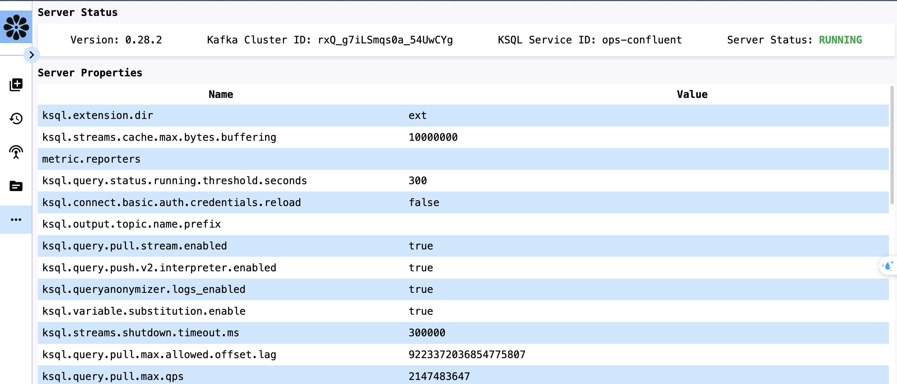

## KSQL UI

### Overview

KSQL UI is a user-friendly interface for interacting with KSQL, a streaming SQL engine for Apache Kafka. It provides a web-based platform to write, execute, and manage KSQL queries, ...

### Features

- Query Editor: Write and execute KSQL queries.
- Streams Management: List, Describe, Drop.
- Topic Management: List Kafka topics.
- Cluster management: Display cluster's information

### Prerequisites

Before setting up KSQL UI, ensure you have the following:
- Node.js: Version 24.x or higher
- Yarn
- Docker

### Installation
Follow these steps to set up KSQL UI locally:
- Clone the repository
    ```shell
    git clone https://github.com/TuanPointC/ksql-ui-nextjs.git
    cd ksql-ui-nextjs
    ```
-  Install Dependencies:
    ```shell
    yarn install
    ```
- Configure Environment
  - Copy the .env.example file to .env:
    ```shell
    cp .env.example .env
    ```
  - Update .env with your KSQL Server URL and other configurations:
    ```plaintext
    KSQL_SERVER_URL="Development=http://localhost:8088"
    ``` 
- Run the Application:
  ```shell
  yarn dev
  ```

Or you can setup using Docker:
```shell
docker run -d -e KSQL_SERVER_URL="Development=http://localhost:8088" -e -p 3000:3000 tuanc/ksql-ui-nextjs
```
### UI
- Request Page
  
  
- History Page
  
  
- Stream Page
  
  
  
  
- Topic Page
  
- Status Page
  
  